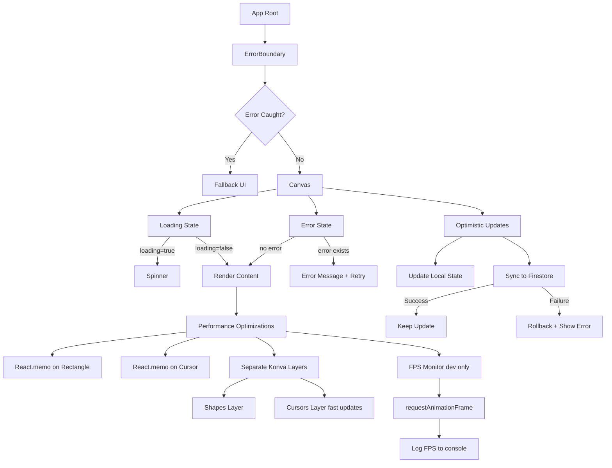
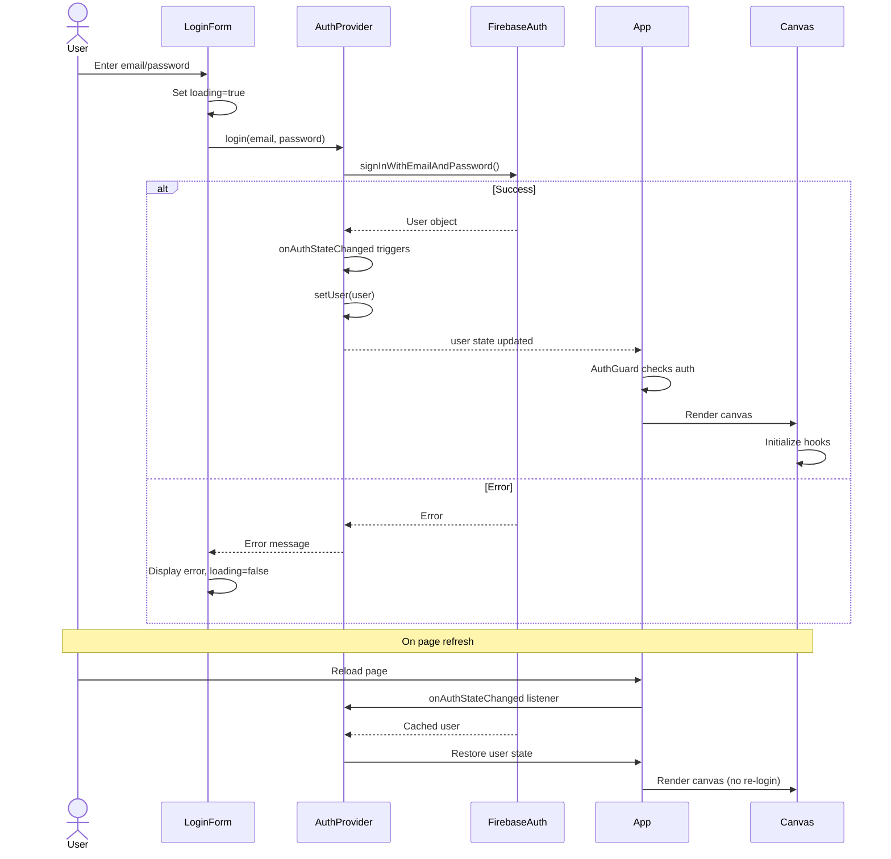
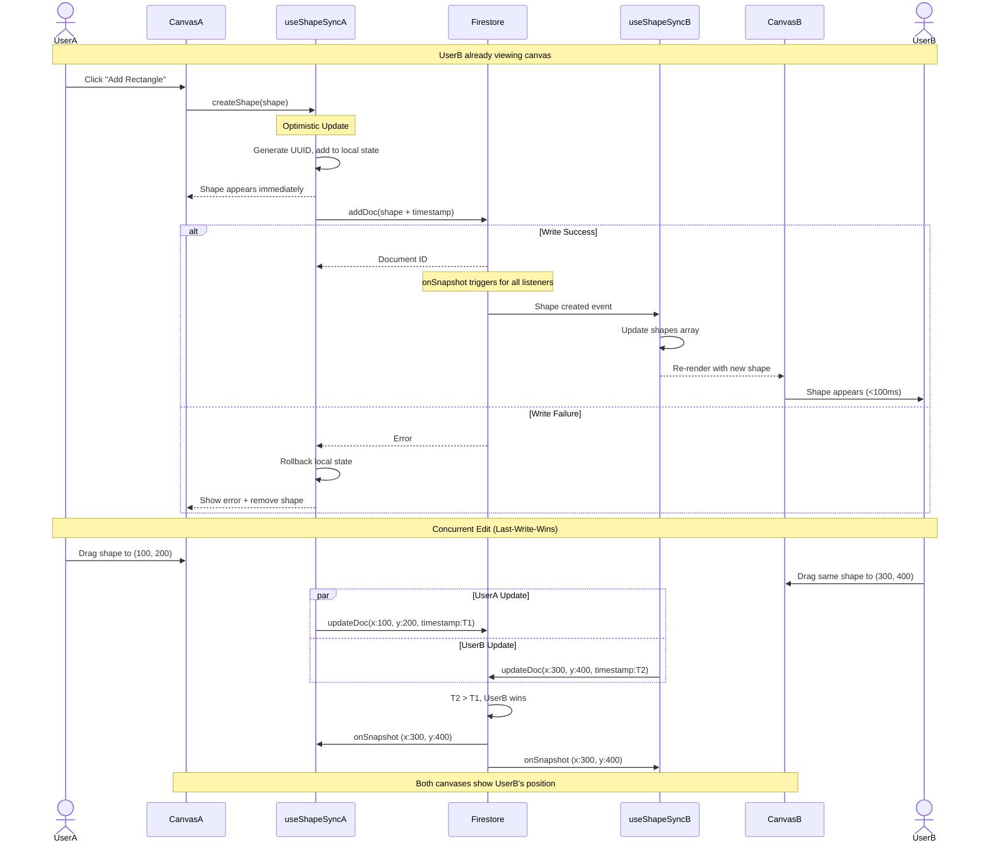
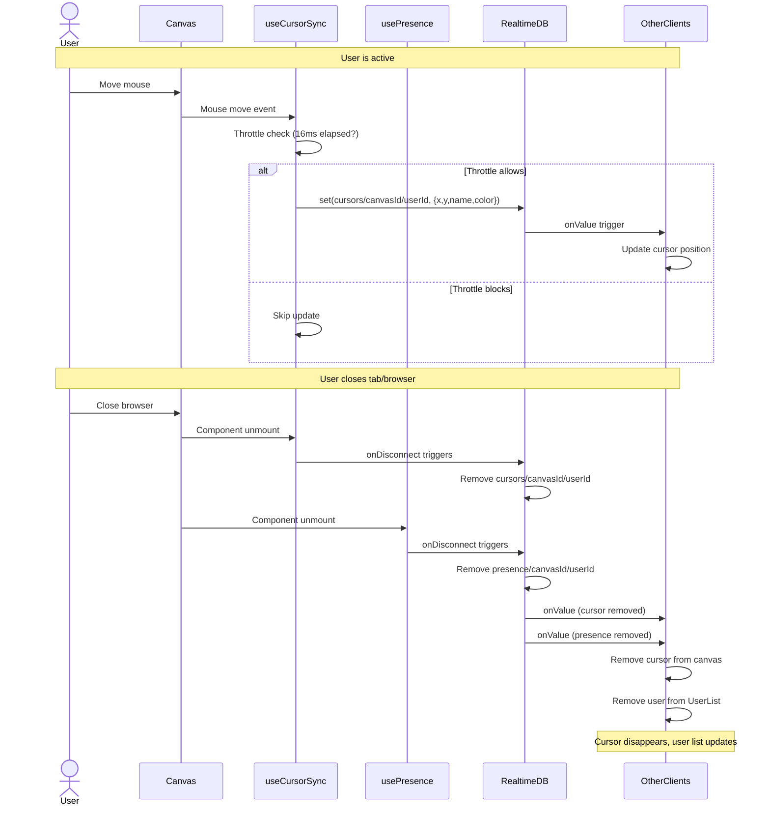

# CollabCanvas Architecture

## 1. Main System Architecture

```mermaid
classDiagram
    %% Core Components
    class App {
        +canvasId: string "default-canvas"
        +usePresence()
        +render Canvas, UserList
    }
    
    class Canvas {
        +stageRef: RefObject
        +selectedId: string | null
        +loading: boolean
        +error: Error | null
        +useShapeSync()
        +useCursorSync()
        +render Rectangle, Cursor, Toolbar
        +handlePanZoom()
        +handleSelection()
    }
    
    class Rectangle {
        +id: string
        +x: number
        +y: number
        +width: number
        +height: number
        +fill: string
        +userId: string
        +createdAt: timestamp
        +updatedAt: timestamp
        +isSelected: boolean
        +onDragEnd()
    }
    
    class Cursor {
        +x: number
        +y: number
        +name: string
        +color: string
        +timestamp: number
        +renderCircleText()
    }
    
    class UserList {
        +onlineUsers: array
        +renderUserList()
        +showCount()
    }
    
    class Toolbar {
        +renderButton()
        +triggerCreateShape()
    }
    
    class Button {
        +label: string
        +onClick()
        +disabled: boolean
    }
    
    class Spinner {
        +size: string
        +render()
    }
    
    class ErrorBoundary {
        +hasError: boolean
        +componentDidCatch()
        +render()
    }
    
    %% Authentication Components
    class AuthProvider {
        +user: User | null
        +loading: boolean
        +login()
        +signup()
        +logout()
        +onAuthStateChanged()
    }
    
    class AuthGuard {
        +renderFormsOrContent()
        +showLoading()
    }
    
    class LoginForm {
        +email: string
        +password: string
        +loading: boolean
        +error: string
        +handleSubmit()
    }
    
    class SignupForm {
        +email: string
        +password: string
        +displayName: string
        +loading: boolean
        +error: string
        +handleSubmit()
    }
    
    %% Custom Hooks
    class useShapeSync {
        +shapes: Shape[]
        +loading: boolean
        +error: Error | null
        +createShape() "optimistic"
        +updateShape() "optimistic"
        +deleteShape()
        +syncToFirestore()
    }
    
    class useCursorSync {
        +cursors: Cursor[]
        +updateCursor() "throttled 16ms"
        +onDisconnect()
        +cleanupStale()
    }
    
    class usePresence {
        +onlineUsers: User[]
        +setPresence()
        +onDisconnect()
        +cleanupOnLeave()
    }
    
    %% Utilities
    class canvasHelpers {
        +generateId() "UUID v4"
        +getCanvasCenter()
        +calculateBounds()
    }
    
    class colors {
        +getUserColor(userId) "hash-based"
        +palette: string[]
    }
    
    %% Type Definitions
    class ShapeTypes {
        <<interface>>
        +Shape
        +ShapeType
        +Position
    }
    
    class UserTypes {
        <<interface>>
        +User
        +AuthUser
    }
    
    class CursorTypes {
        <<interface>>
        +Cursor
        +CursorPosition
    }
    
    %% Firebase Config
    class FirebaseConfig {
        +app: FirebaseApp
        +auth: Auth
        +db: Firestore
        +rtdb: Database
        +initializeApp()
    }

    %% Component Relationships
    ErrorBoundary --> App : wraps
    App --> Canvas : renders
    App --> UserList : renders
    App --> AuthProvider : wraps
    App --> AuthGuard : wraps
    Canvas --> Rectangle : renders multiple
    Canvas --> Cursor : renders multiple
    Canvas --> Toolbar : renders
    Canvas --> Spinner : shows loading
    Toolbar --> Button : renders
    AuthProvider --> LoginForm : provides context
    AuthProvider --> SignupForm : provides context
    AuthGuard --> LoginForm : renders if unauthenticated
    AuthGuard --> SignupForm : renders if unauthenticated
    
    %% Hook Usage
    Canvas --> useShapeSync : uses
    Canvas --> useCursorSync : uses
    App --> usePresence : uses
    useShapeSync --> canvasHelpers : uses
    useCursorSync --> colors : uses
    usePresence --> colors : uses
    
    %% Type Dependencies
    Rectangle --> ShapeTypes : implements
    Canvas --> ShapeTypes : uses
    AuthProvider --> UserTypes : uses
    Cursor --> CursorTypes : implements
    
    %% Firebase Dependencies
    AuthProvider --> FirebaseConfig : uses auth
    useShapeSync --> FirebaseConfig : uses db
    useCursorSync --> FirebaseConfig : uses rtdb
    usePresence --> FirebaseConfig : uses rtdb

    %% Client-Server Interactions
    subgraph ClientServerInteractions
        direction LR
        Client[Browser React + Konva.js] -->|Auth| FirebaseAuth[Firebase Auth]
        Client -->|Shape CRUD| Firestore[Firestore: canvases/canvasId/shapes]
        Client -->|Cursor throttled 16ms| RealtimeDB[Realtime DB: cursors/canvasId/userId]
        Client -->|Presence| RealtimeDB2[Realtime DB: presence/canvasId/userId]
        Client -->|Static Files| FirebaseHosting[Firebase Hosting]
        FirebaseAuth -->|User Data| Client
        Firestore -->|onSnapshot| Client
        RealtimeDB -->|onValue| Client
        RealtimeDB2 -->|onValue| Client
    end

    %% Technologies
    class Technologies {
        +React 18: UI Framework
        +Konva.js: Canvas Rendering
        +TypeScript: Type Safety
        +Firebase 9+: Backend Services
        +Jest: Testing Framework
        +React Testing Library: Component Tests
    }

    %% Technology Links
    App --> Technologies : uses
    Canvas --> Technologies : uses Konva.js
    AuthProvider --> Technologies : uses Firebase Auth
    useShapeSync --> Technologies : uses Firestore
    useCursorSync --> Technologies : uses Realtime DB
    usePresence --> Technologies : uses Realtime DB
```

---

## 2. Error Handling & Performance Architecture



### Performance Features:
- **React.memo**: Prevents unnecessary re-renders of Rectangle and Cursor components
- **Layer Separation**: Shapes and cursors on separate Konva layers for independent rendering
- **Throttling**: Cursor updates limited to 16ms (60fps) to reduce network load
- **Optimistic Updates**: UI updates immediately before server confirmation
- **FPS Monitoring**: Development-only requestAnimationFrame counter

---

## 3. Testing Infrastructure

```mermaid
graph LR
    A[Source Files] --> B[Test Files]
    
    subgraph Components
        C1[Canvas.tsx] --> T1[Canvas.test.tsx]
        C2[Rectangle.tsx] --> T2[Rectangle.test.tsx]
        C3[Cursor.tsx] --> T3[Cursor.test.tsx]
        C4[LoginForm.tsx] --> T4[LoginForm.test.tsx]
        C5[SignupForm.tsx] --> T5[SignupForm.test.tsx]
    end
    
    subgraph Hooks
        H1[useShapeSync.ts] --> TH1[useShapeSync.test.ts]
        H2[useCursorSync.ts] --> TH2[useCursorSync.test.ts]
        H3[usePresence.ts] --> TH3[usePresence.test.ts]
    end
    
    subgraph Utils
        U1[canvasHelpers.ts] --> TU1[canvasHelpers.test.ts]
        U2[colors.ts] --> TU2[colors.test.ts]
    end
    
    subgraph Context
        X1[AuthContext.tsx] --> TX1[AuthContext.test.tsx]
    end
    
    B --> J[Jest Test Runner]
    J --> RTL[@testing-library/react]
    J --> FM[Firebase Mocks]
    
    RTL --> R1[Unit Tests]
    RTL --> R2[Integration Tests]
    
    FM --> R3[Mock Firestore]
    FM --> R4[Mock Realtime DB]
    FM --> R5[Mock Auth]
```

### Test Coverage:
- **Unit Tests**: Utilities, pure functions, isolated components
- **Integration Tests**: Hook flows, component interactions, Firebase integration
- **Mocking Strategy**: Firebase services mocked to avoid real API calls
- **Target Coverage**: 80%+ on critical paths

---

## 4. Authentication Flow



---

## 5. Shape Synchronization Flow



---

## 6. Disconnect Handling Flow



---

## 7. Data Models

### Shape Interface
```typescript
interface Shape {
  id: string;              // UUID v4
  type: 'rectangle';       // MVP: only rectangles
  x: number;               // Canvas position
  y: number;
  width: number;           // Fixed: 150
  height: number;          // Fixed: 100
  fill: string;            // Fixed: '#3498db'
  userId: string;          // Creator's Firebase UID
  createdAt: Timestamp;    // Firebase Timestamp
  updatedAt: Timestamp;    // For conflict resolution
}
```

### User Type
```typescript
interface User {
  uid: string;             // Firebase UID
  email: string;
  displayName: string;     // Required at signup
}
```

### Cursor Type
```typescript
interface Cursor {
  x: number;               // Canvas coordinates
  y: number;
  name: string;            // User displayName
  color: string;           // Hash-based from userId
  timestamp: number;       // Date.now() for staleness check
}
```

### Presence Type
```typescript
interface Presence {
  userId: string;
  name: string;            // User displayName
  color: string;           // Same as cursor color
  joinedAt: number;        // Date.now()
}
```

---

## 8. Implementation Details

### Canvas ID Management
- **MVP**: Hardcoded as `"default-canvas"`
- **Location**: `App.tsx` - `const canvasId = "default-canvas"`
- **Future**: URL-based routing for multiple canvases

### Conflict Resolution
- **Strategy**: Last-Write-Wins
- **Implementation**: Firestore `updatedAt` timestamp comparison
- **Limitation**: No operational transforms; simpler conflicts only

### Throttling Mechanism
```javascript
let lastUpdate = 0;
const handleMouseMove = () => {
  const now = Date.now();
  if (now - lastUpdate < 16) return; // 60fps = 16ms
  lastUpdate = now;
  // ... update cursor
};
```

### Environment Variables
```bash
# .env.local
REACT_APP_FIREBASE_API_KEY=xxx
REACT_APP_FIREBASE_AUTH_DOMAIN=xxx
REACT_APP_FIREBASE_PROJECT_ID=xxx
REACT_APP_FIREBASE_STORAGE_BUCKET=xxx
REACT_APP_FIREBASE_MESSAGING_SENDER_ID=xxx
REACT_APP_FIREBASE_APP_ID=xxx
REACT_APP_FIREBASE_DATABASE_URL=xxx
```

### Firebase Rules (Test Mode for MVP)
```javascript
// Firestore
rules_version = '2';
service cloud.firestore {
  match /databases/{database}/documents {
    match /{document=**} {
      allow read, write: if true; // TODO: Add auth checks for production
    }
  }
}

// Realtime Database
{
  "rules": {
    ".read": true,
    ".write": true  // TODO: Add auth checks for production
  }
}
```

---

## 9. Performance Targets & Monitoring

| Metric | Target | Measurement Method |
|--------|--------|-------------------|
| Object Sync Latency | <100ms | Network tab + console.log |
| Cursor Sync Latency | <50ms | performance.now() timestamps |
| Frame Rate (Pan/Zoom) | 60 FPS | requestAnimationFrame counter |
| Frame Rate (Idle) | 60 FPS | Chrome DevTools Performance |
| Concurrent Users | 5+ | Manual multi-browser test |
| Shape Count | 500+ | Manual stress test |

### FPS Monitoring (Development Only)
```javascript
let lastTime = performance.now();
let frames = 0;

function checkFPS() {
  frames++;
  const now = performance.now();
  if (now >= lastTime + 1000) {
    console.log('FPS:', frames);
    frames = 0;
    lastTime = now;
  }
  requestAnimationFrame(checkFPS);
}

if (process.env.NODE_ENV === 'development') {
  checkFPS();
}
```

---

## 10. File Structure

```
collabcanvas/
├── src/
│   ├── components/
│   │   ├── Canvas.tsx
│   │   ├── Canvas.test.tsx
│   │   ├── Rectangle.tsx
│   │   ├── Rectangle.test.tsx
│   │   ├── Cursor.tsx
│   │   ├── Cursor.test.tsx
│   │   ├── Toolbar.tsx
│   │   ├── Button.tsx
│   │   ├── UserList.tsx
│   │   ├── Spinner.tsx
│   │   ├── ErrorBoundary.tsx
│   │   └── Auth/
│   │       ├── AuthGuard.tsx
│   │       ├── LoginForm.tsx
│   │       ├── LoginForm.test.tsx
│   │       ├── SignupForm.tsx
│   │       └── SignupForm.test.tsx
│   ├── contexts/
│   │   ├── AuthContext.tsx
│   │   └── AuthContext.test.tsx
│   ├── hooks/
│   │   ├── useShapeSync.ts
│   │   ├── useShapeSync.test.ts
│   │   ├── useCursorSync.ts
│   │   ├── useCursorSync.test.ts
│   │   ├── usePresence.ts
│   │   └── usePresence.test.ts
│   ├── utils/
│   │   ├── canvasHelpers.ts
│   │   ├── canvasHelpers.test.ts
│   │   ├── colors.ts
│   │   └── colors.test.ts
│   ├── types/
│   │   ├── shape.types.ts
│   │   ├── user.types.ts
│   │   └── cursor.types.ts
│   ├── firebase.ts
│   ├── App.tsx
│   ├── index.tsx
│   └── index.css
├── .env.local
├── .gitignore
├── package.json
├── tsconfig.json
└── firebase.json
```

---

## Architecture Overview Summary

### Component Structure
- **App**: Root component with ErrorBoundary, AuthProvider, manages canvas ID and presence
- **Canvas**: Main workspace with pan/zoom, shape/cursor rendering, selection state
- **Authentication**: Context-based auth with guard, forms, and persistent sessions
- **UI Components**: Toolbar, Button, UserList, Spinner, ErrorBoundary

### Custom Hooks
- **useShapeSync**: Real-time shape sync via Firestore with optimistic updates
- **useCursorSync**: Real-time cursor tracking via Realtime DB (throttled to 60fps)
- **usePresence**: Online user tracking via Realtime DB with disconnect cleanup

### Data Flow
1. **Shapes** (persistent): Browser ↔ Firestore (canvases/{canvasId}/shapes)
2. **Cursors** (ephemeral): Browser ↔ Realtime DB (cursors/{canvasId}/{userId})
3. **Presence** (ephemeral): Browser ↔ Realtime DB (presence/{canvasId}/{userId})
4. **Authentication**: Browser ↔ Firebase Auth

### Key Patterns
- **Optimistic Updates**: Immediate UI feedback before server confirmation
- **Last-Write-Wins**: Simple conflict resolution using timestamps
- **Throttling**: 16ms (60fps) limit on cursor updates to reduce costs
- **Error Boundaries**: Graceful error handling with fallback UI
- **Performance Optimization**: React.memo, layer separation, FPS monitoring

